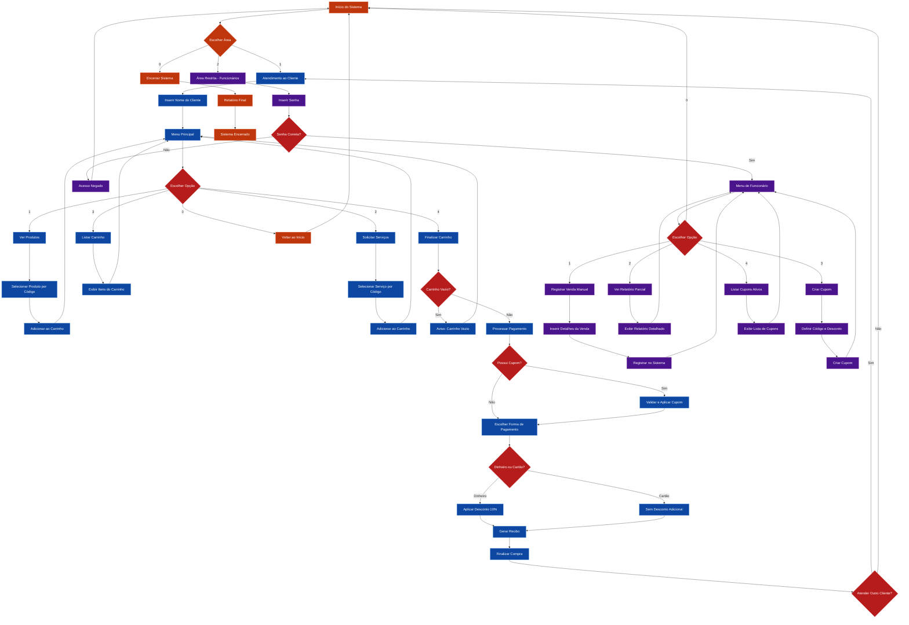

# CuidaPet - Sistema de Autoatendimento

Sistema de autoatendimento para pet shop desenvolvido em Dart.

## 📝 Descrição do Sistema

O CuidaPet é um sistema de autoatendimento completo para pet shops que permite aos clientes navegar pelo catálogo de produtos e serviços, adicionar itens ao carrinho, aplicar cupons de desconto e finalizar compras. Também possui uma área restrita para funcionários gerenciarem vendas e criarem cupons promocionais.

## ⚡ Funcionalidades Implementadas

### Sistema de Atendimento ao Cliente:

- ✅ **Navegação com opção "voltar"** em todos os menus
- ✅ **Reinício automático** após vendas concluídas
- ✅ **Validação robusta** de todas as entradas do usuário
- ✅ **Carrinho de compras** com listagem detalhada
- ✅ **Sistema de cupons** com criação e aplicação
- ✅ **Desconto de 10%** para pagamentos em dinheiro
- ✅ **Recibo formatado** com todos os detalhes da compra

### Sistema para Funcionários:

- ✅ **Área restrita** com autenticação por senha
- ✅ **Registro manual de vendas** para vendas externas
- ✅ **Criação de cupons promocionais** com desconto personalizado
- ✅ **Listagem de cupons ativos** com códigos e descontos
- ✅ **Relatórios de vendas** com faturamento total e detalhes

### Características Técnicas:

- ✅ **Nomes de variáveis/funções em inglês** para padronização
- ✅ **Logs e mensagens em português** para usuários brasileiros
- ✅ **Organização de dados** em pasta dedicada (`data/`)
- ✅ **Validação de entrada** com feedback específico para cada tipo de erro
- ✅ **Truncamento de nomes** (15 caracteres) para formatação consistente

## 🔄 Fluxo do Sistema



## � Requisitos para Execução

- **Dart SDK** versão 2.17 ou superior
- **Sistema Operacional**: Windows, macOS ou Linux
- **Terminal/Command Prompt** para execução

## 🚀 Como Rodar Localmente

1. **Verificar instalação do Dart:**

   ```bash
   dart --version
   ```

2. **Navegar para o diretório do projeto:**

   ```bash
   cd cuida-pet-main
   ```

3. **Executar o sistema:**
   ```bash
   dart run lib/main.dart
   ```

## � Instruções Básicas de Uso

### Para Clientes:

1. **Iniciar atendimento** - Digite seu nome quando solicitado
2. **Navegar pelos menus** - Use as opções numéricas para navegar
3. **Adicionar itens** - Selecione produtos ou serviços pelo código
4. **Aplicar cupons** - Durante a finalização, informe se possui cupom
5. **Escolher pagamento** - Selecione entre dinheiro (desconto de 10%) ou cartão
6. **Receber recibo** - Recibo detalhado será exibido automaticamente

### Para Funcionários:

1. **Acesso restrito** - Use a senha: `cuidapetrestrito`
2. **Registrar vendas** - Registre vendas manuais no sistema
3. **Criar cupons** - Crie cupons promocionais com desconto personalizado
4. **Listar cupons** - Visualize todos os cupons ativos no sistema
5. **Visualizar relatórios** - Consulte relatórios de vendas e faturamento

## 💡 Exemplo de Uso

### Cenário: Cliente comprando ração e serviço de banho

1. **Iniciando o atendimento:**

   ```
   Escolha uma opção: 1
   Digite seu nome: Maria Silva
   Olá, Maria Silva! Vamos começar seu atendimento.
   ```

2. **Adicionando produto (ração):**

   ```
   ===== MENU PRINCIPAL =====
   1 - Ver promoções de produtos
   Escolha uma opção: 1

   Digite o código do produto (ou 0 para voltar): P001
   Produto "Ração Premium" adicionado ao carrinho!
   ```

3. **Adicionando serviço (banho):**

   ```
   2 - Solicitar serviços
   Escolha uma opção: 2

   Digite o código do serviço (ou 0 para voltar): S001
   Serviço "Banho e Tosa" adicionado ao carrinho!
   ```

4. **Finalizando compra com cupom:**

   ```
   4 - Finalizar carrinho
   Escolha uma opção: 4

   Possui cupom de desconto? (s/n): s
   Digite o código do cupom: PROMO10
   Cupom aplicado! Desconto de 10.0%

   Forma de pagamento:
   1 - Dinheiro (10% desconto)
   2 - Cartão
   Escolha: 1
   ```

5. **Recibo gerado:**

   ```
   ========== RECIBO ==========
   Cliente: Maria Silva
   Data: 15/09/2025 14:30

   Ração Premium    R$ 45,90
   Banho e Tosa     R$ 35,00

   Subtotal:        R$ 80,90
   Desc. Cupom:    -R$  8,09
   Desc. Dinheiro: -R$  7,28
   TOTAL:           R$ 65,53

   Obrigado pela preferência!
   ===========================
   ```

## 🏗️ Estrutura do Projeto

```
cuida-pet-main/
├── lib/
│   ├── main.dart                    # Ponto de entrada da aplicação
│   ├── controllers/                 # Controladores do sistema
│   │   ├── SystemController.dart    # Controle principal do sistema
│   │   ├── MenuController.dart      # Controle dos menus do cliente
│   │   └── EmployeeController.dart  # Controle da área de funcionários
│   ├── models/                      # Modelos de dados
│   │   ├── Customer.dart           # Modelo do cliente
│   │   ├── Product.dart            # Modelo de produto
│   │   ├── Service.dart            # Modelo de serviço
│   │   └── CartItem.dart           # Item do carrinho
│   ├── data/                       # Dados iniciais do sistema
│   │   └── InitialData.dart        # Produtos e serviços padrão
│   └── utils/                      # Utilitários do sistema
│       ├── InputValidator.dart     # Validação de entradas
│       ├── ReceiptGenerator.dart   # Geração de recibos
│       └── CouponManager.dart      # Gerenciamento de cupons
└── README.md                       # Este arquivo
```

## 🛠️ Detalhes Técnicos

### Validações Implementadas:

- **Entradas numéricas:** Aceita apenas números inteiros válidos
- **Nomes de usuários:** Mínimo 2 caracteres, apenas letras e espaços
- **Valores monetários:** Aceita apenas números positivos com até 2 casas decimais
- **Códigos:** Validação de formato alfanumérico
- **Confirmações:** Aceita apenas 's', 'sim', 'n', 'não' (case-insensitive)

### Sistema de Logs:

- **Mensagens em português** para melhor experiência do usuário brasileiro
- **Feedback específico** para cada tipo de erro de validação
- **Confirmações visuais** para ações realizadas com sucesso

### Formatação e Layout:

- **Truncamento automático** de nomes com mais de 15 caracteres
- **Alinhamento de valores** nos recibos e relatórios
- **Separadores visuais** para melhor organização das informações
- **Cores e símbolos** para destacar informações importantes

## � Créditos da Equipe

- **Leonardo Paiva** - Desenvolvedor
- **Ryan Mendes** - Desenvolvedor
- **Salomão Junior** - Desenvolvedor

## 💡 Sugestões de Melhorias Futuras

- **Integração com banco de dados** para persistência de dados
- **Interface gráfica** com framework Flutter
- **Sistema de estoque** com controle automático de inventário
- **Relatórios avançados** com gráficos e estatísticas
- **Sistema de fidelidade** com pontos e recompensas
- **Integração com pagamento** via PIX e cartões
- **Notificações** por email ou SMS para clientes
- **Backup automático** de dados e configurações
- **Múltiplas unidades** com sincronização entre lojas
- **App mobile** para facilitar o atendimento

---

**Versão atual:** 2.0  
**Última atualização:** Setembro 2025
